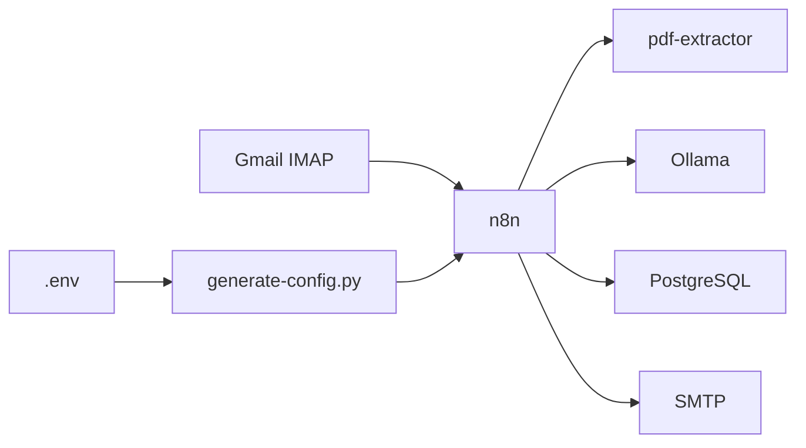
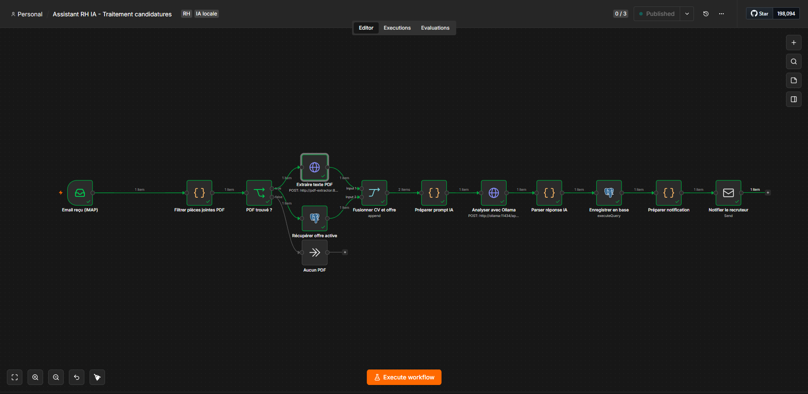
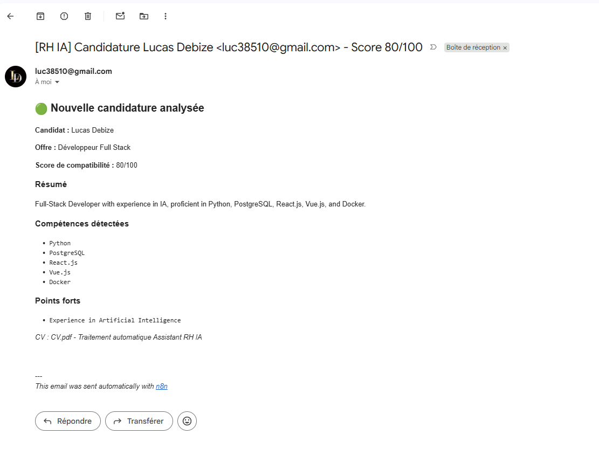
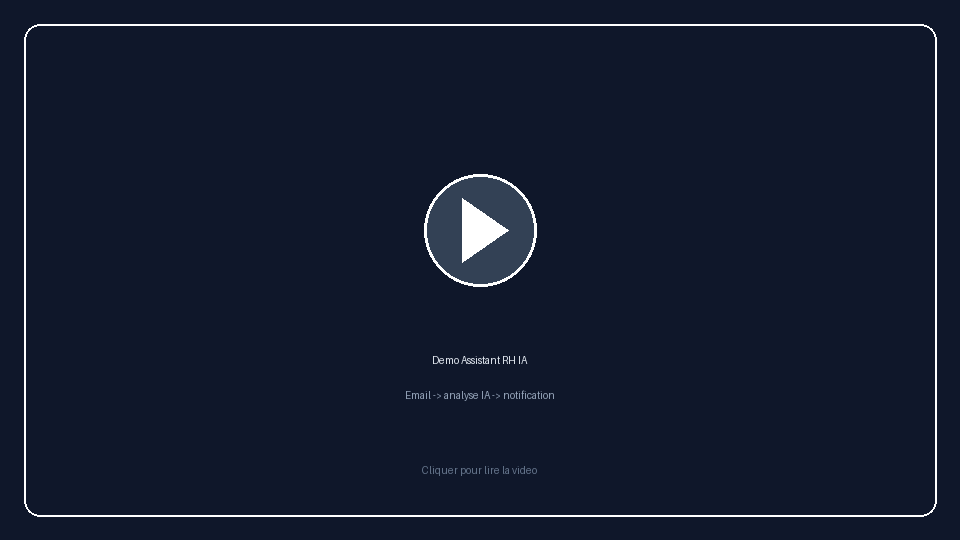

# Assistant RH IA - Automatisation des candidatures

Workflow **100 % local** : réception d'un email avec CV PDF → extraction → analyse IA (Ollama) → stockage PostgreSQL → notification recruteur. Configuration via **un seul fichier `.env`**.

## Aperçu



### Workflow n8n

Capture du workflow publié dans l'interface n8n.



### Notification recruteur

Email de score reçu par le recruteur après analyse du CV.



### Démo vidéo

Parcours complet : envoi d'un email avec CV → analyse IA → notification.

[](assets/videos/demo.mp4)

> GitHub ne lit pas les MP4 directement dans le README. Cliquez sur l'image pour ouvrir le lecteur vidéo.


## Principe

```
Email (IMAP) → n8n → pdf-extractor → Ollama → PostgreSQL → SMTP
       ↑
     .env → generate-config.py → n8n/generated/ → sync-n8n.sh
```

Le workflow est **déclenché à la réception** d'un email (nœud IMAP), pas par une planification.

## Démarrage

```bash
cd assistant_RH_IA
cp .env.example .env
./scripts/setup.sh
```

| Commande | Quand |
|----------|-------|
| `./scripts/setup.sh` ou `make setup` | Installation complète |
| `./scripts/sync-n8n.sh` ou `make sync` | Après modification du `.env` |
| `docker compose up -d` | PC redémarré, `.env` inchangé |
| `docker compose down` | Arrêter |

## Configuration `.env`

| Variable | Description |
|----------|-------------|
| `IMAP_USER` / `IMAP_PASSWORD` | Boîte mail surveillée |
| `SMTP_USER` / `SMTP_PASSWORD` | Envoi des notifications |
| `RECRUITER_EMAIL` | Destinataire des alertes RH |
| `OLLAMA_MODEL` | Modèle IA local (`mistral`) |
| `POSTGRES_*` | Base de données |
| `N8N_ENCRYPTION_KEY` | Clé n8n (32+ car., ne pas changer après 1er lancement) |

Gmail : activer IMAP + [mot de passe d'application](https://myaccount.google.com/apppasswords). Les espaces dans le mot de passe sont supprimés automatiquement.

## Test

1. `./scripts/setup.sh`
2. Créer le compte admin sur http://localhost:5678 (1ère visite)
3. Envoyer un email avec PDF à `IMAP_USER`
4. Vérifier la notification sur `RECRUITER_EMAIL` (quelques secondes)

Les résultats en base s'affichent en terminal :

```bash
docker compose exec postgres psql -U rh_admin -d assistant_rh -c \
  "SELECT email_expediteur, score_compatibilite FROM candidatures ORDER BY date_traitement DESC LIMIT 5;"
```

## Architecture

| Service | Rôle |
|---------|------|
| n8n | Orchestration |
| pdf-extractor | Extraction PDF |
| Ollama | IA locale |
| PostgreSQL | Stockage |

## Structure du projet

```
assistant_RH_IA/
├── .env.example
├── assets/
│   ├── images/          # workflow-n8n.png, notification-email.png, demo-poster.png
│   └── videos/          # demo.mp4
├── database/init.sql
├── docker-compose.yml
├── Makefile
├── n8n/
│   ├── templates/       # assistant-rh-ia.template.json, credentials.json.template
│   └── generated/       # workflow.json, credentials.json (gitignored)
├── scripts/
│   ├── setup.sh
│   ├── sync-n8n.sh
│   ├── sync-n8n.ps1
│   ├── fix-n8n-workflows.sh
│   ├── generate-config.py
│   └── lib/load-env.sh
└── services/pdf-extractor/
```

## Dépannage

| Problème | Solution |
|----------|----------|
| Workflow inactif | `./scripts/sync-n8n.sh` |
| Credentials invalides | Vérifier `.env`, puis `./scripts/sync-n8n.sh` |
| Doublon de workflow | `./scripts/fix-n8n-workflows.sh` |
| Ollama timeout | `docker compose exec ollama ollama pull mistral` |
| `.env` édité sous Windows | CRLF supprimés automatiquement au chargement |

## Commandes utiles

```bash
make setup
make sync
make up
make down
make logs
```

## Licence

Projet open source - usage libre pour apprentissage et démonstration.
